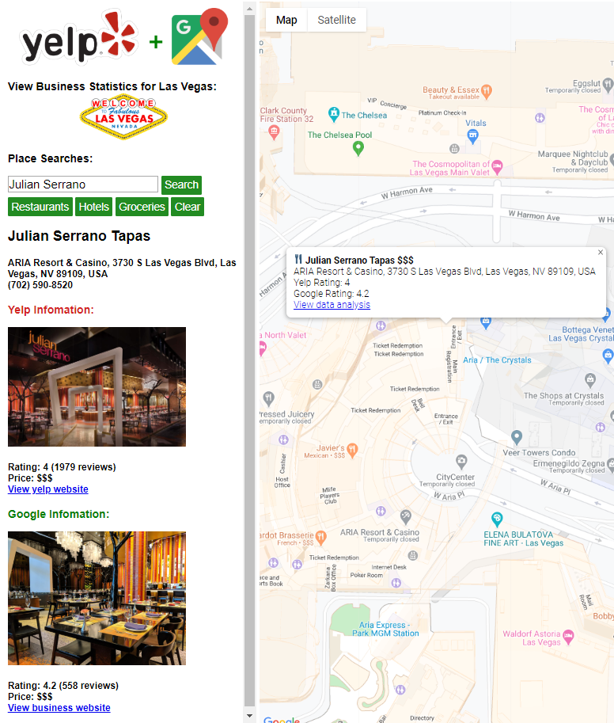

# Google-Yelp Data Analysis and Visualization

**Authors:**

**Team9: Wenyan Du, Jieyan Chen, Boxuan Li, Miao Sun, Ruiying Wang**

## 1 Introduction

Google Maps has built APIs that can be conveniently incorporated into all sorts of websites and applications. Yelp.com also utilizes Google Maps API. On the Yelp website, users can access the Google map-view of businesses with rich Yelp business information and reviews. However, users who locate businesses directly using Google Maps could not easily access Yelp reviews, as Google Maps provide only reviews and ratings assembled by Google. It is reasonable to believe that more users would access Google Maps rather than Yelp when looking for business information since Google Maps has five times more monthly users than Yelp.

## 2 Main Page

The figure demonstrate the main page of the project. In the left panel, there are

1) Yelp+Google logo

2) View Business statistics (click on “Las Vegas" Icon to show new page)

3) Places Searches

4) Quick searches of restaurants, hotels or groceries

5) Detailed business information from both Yelp and Google will be displayed when mouse clicking a POI

The right panel is the map area, after mouse click of a POI, a tooltip shows both Yelp and Google information (click on “View data analysis" will open a new page). Note: We use red color to indicate data from Yelp and green for Google.

## 3 Topic Modeling

For data analysis, we conveyed topic modeling and sentence analysis on Yelp review data (from Yelp Open Dataset). For a good demonstration, we analyzed reviews from Las Vegas, because it has the most number of businesses in Yelp. We included all review sentences to conduct a topic modeling and provided the keyword bags out of the top five topics. Then we implemented the sentiment analysis on all reviews, with three reviews with the highest sentiment scores and another three with the lowest scores. Basically, these reviews can represent the most positive and negative comments towards the business from the public, and provide sufficiently valuable information to customers. Both keywords with the highest occurrence in the reviews and the 6 reviews obtained from the sentiment analysis will be shown. 
